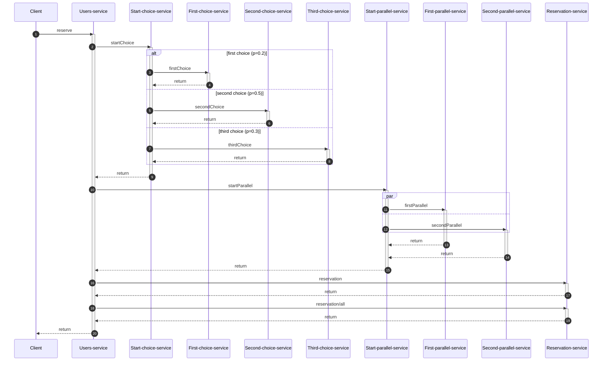

```mermaid
sequenceDiagram
    %% INIT
    autonumber
    participant Client
    participant Users-service
    participant Start-choice-service
    participant First-choice-service
    participant Second-choice-service
    participant Third-choice-service
    participant Start-parallel-service
    participant First-parallel-service
    participant Second-parallel-service
    participant Reservation-service

    %% CLIENT
    Client->>Users-service: reserve
    activate Users-service

    %% XOR
    Users-service->>Start-choice-service: startChoice
    activate Start-choice-service
    alt first choice (p=0.2)
        Start-choice-service->>First-choice-service: firstChoice
        activate First-choice-service
        First-choice-service-->>Start-choice-service: return
        deactivate First-choice-service
    else second choice (p=0.5)
        Start-choice-service->>Second-choice-service: secondChoice
        activate Second-choice-service
        Second-choice-service-->>Start-choice-service: return
        deactivate Second-choice-service
    else third choice (p=0.3)
        Start-choice-service->>Third-choice-service: thirdChoice
        activate Third-choice-service
        Third-choice-service-->>Start-choice-service: return
        deactivate Third-choice-service
    end
    Start-choice-service-->>Users-service: return
    deactivate Start-choice-service

    %% AND
    Users-service->>Start-parallel-service: startParallel
    activate Start-parallel-service
    par
        Start-parallel-service->>First-parallel-service: firstParallel
        activate First-parallel-service
    and
        Start-parallel-service->>Second-parallel-service: secondParallel
        activate Second-parallel-service
    end
    First-parallel-service-->>Start-parallel-service: return
    deactivate First-parallel-service
    Second-parallel-service-->>Start-parallel-service: return
    deactivate Second-parallel-service
    Start-parallel-service-->>Users-service: return
    deactivate Start-parallel-service


    %% OTHER
    Users-service->>Reservation-service: reservation
    activate Reservation-service
    Reservation-service-->>Users-service: return
    deactivate Reservation-service

    Users-service->>Reservation-service: reservation/all
    activate Reservation-service
    Reservation-service-->>Users-service: return
    deactivate Reservation-service

    %% END
    Users-service-->>Client: return
    deactivate Users-service
```